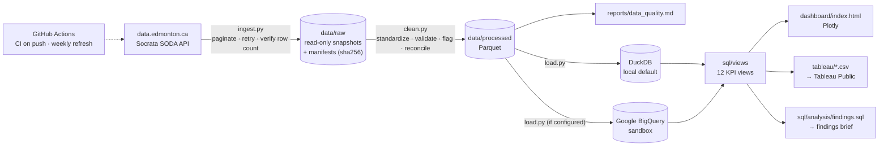
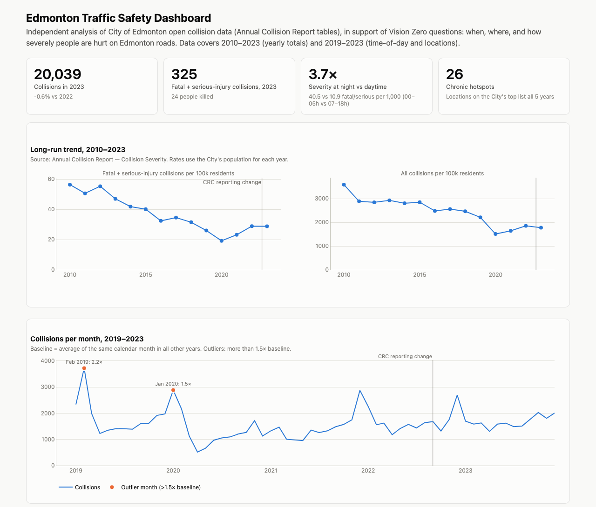
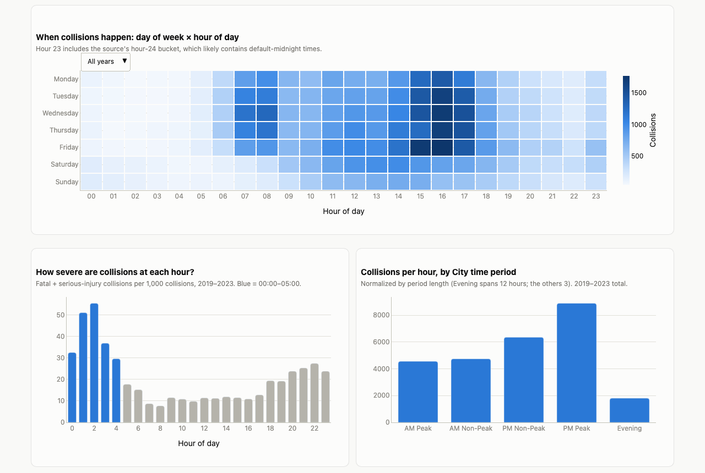
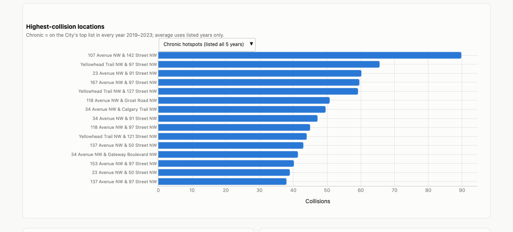
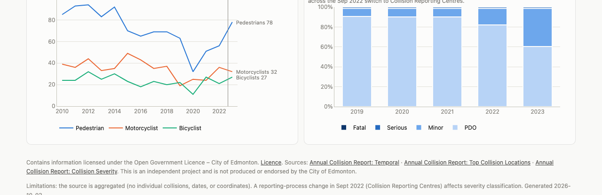

# Edmonton Traffic Safety Analytics (Vision Zero)

An automated analytics pipeline built on **real City of Edmonton open collision data** (Annual Collision Report,
2010–2023). It answers the questions a Vision Zero team asks: *when* collisions happen, *where* they keep
happening, and *how severely* people are hurt. Data quality is documented and tested at every step.

**Stack:** Python · Pandas · SQL (DuckDB locally, Google BigQuery in the cloud) · Plotly · Tableau Public · pytest · GitHub Actions

| | |
|---|---|
| Data | 3 City of Edmonton datasets, 19,120 raw rows, 100% retained after cleaning, all 9 validation checks passing |
| SQL | 12 KPI views, written once and run on both DuckDB and BigQuery |
| Outputs | Interactive Plotly dashboard, 12 Tableau-ready extracts, a plain-language findings brief for managers |
| Quality | 90 offline pytest tests; CI on every push; scheduled weekly refresh |

**Headline findings** (details in [reports/findings_brief.md](reports/findings_brief.md)):

- Collisions between midnight and 5 a.m. are **3.7× more likely** to be fatal or serious than daytime collisions (40.5 vs 10.9 per 1,000).
- **28%** of collisions happen in the 3–6 p.m. window, every year.
- **26 locations** were on the City's top-collision list in all five years; 107 Ave & 142 St reached **169 collisions** in 2023.

---

## Contents
[Architecture](#architecture) · [Data source](#data-source-and-licence) · [Data dictionary](#data-dictionary) ·
[Cleaning methodology](#cleaning-methodology) · [KPI definitions](#kpi-definitions) · [Dashboards](#dashboards) ·
[Run it locally](#run-it-locally) · [BigQuery](#run-with-google-bigquery) · [Tests](#tests-and-automation) ·
[Project history](#project-history)

---

## Architecture



```
src/traffic_safety/
  config.py      dataset registry, paths, licence attribution
  ingest.py      Socrata ingestion with pagination, retries, row-count verification, immutable raw cache
  clean.py       cleaning + validation rules (each logs rows affected) and cross-dataset reconciliation
  quality.py     data-quality bookkeeping and report writer
  load.py        DuckDB / BigQuery loader; renders the shared SQL for each engine
  dashboard.py   Plotly dashboard built only from the KPI views
  findings.py    runs the named analysis queries and writes the evidence report
  pipeline.py    one command for the whole flow
sql/views/       12 KPI views (portable SQL, {placeholders} filled per engine)
sql/analysis/    named queries behind every number in the findings brief
tests/           pytest suite + small fixture CSVs (no network)
tableau/         one CSV extract per KPI view + BUILD_GUIDE.md
reports/         data_quality.md, findings_brief.md, findings_evidence.md
```

## Data source and licence

| Dataset | Portal | Rows | Coverage | Used for |
|---|---|---:|---|---|
| Annual Collision Report: Temporal | [jduq-w5pj](https://data.edmonton.ca/d/jduq-w5pj) | 18,545 | 2019–2023 | Main fact table: collisions by year × month × day of week × hour × severity |
| Annual Collision Report: Top Collision Locations | [mf6n-s5ts](https://data.edmonton.ca/d/mf6n-s5ts) | 561 | 2019–2023 | Top ~50 intersections and midblocks per year |
| Annual Collision Report: Collision Severity | [77sf-j5rj](https://data.edmonton.ca/d/77sf-j5rj) | 14 | 2010–2023 | Yearly totals, injuries and fatalities by road user, population; also used to reconcile the Temporal table |

All three tables are maintained manually by the City and updated once a year. They are **aggregated**: the City does
not publish individual collision records, so there are no exact dates or coordinates.

**Licence:** [Open Government Licence – City of Edmonton](https://data.edmonton.ca/stories/s/City-of-Edmonton-Open-Data-Terms-of-Use/msh8-if28).
*Contains information licensed under the Open Government Licence – City of Edmonton.*
This is an independent project; it is not produced or endorsed by the City of Edmonton.

## Data dictionary

Cleaned tables, as loaded into DuckDB and BigQuery.

### `temporal`: one row per year × month × season × day × hour × severity
| Column | Type | Description |
|---|---|---|
| `year`, `month`, `month_name`, `season` | int, int, text, text | When the collisions occurred (season follows astronomical dates, so Mar/Jun/Sep/Dec span two) |
| `day_of_week_num`, `day_of_week`, `day_type`, `is_weekend` | int (Mon=1), text, text, bool | Day of week |
| `hour_code` | int | Source hour code 0–24; code *h* covers (*h*−1):01 to *h*:00 |
| `hour_of_day`, `hour_label` | int (0–23, null for code 0), text | Clock hour derived from `hour_code − 1` |
| `hour_group` | text | City time period: AM Peak, AM Non-Peak, PM Non-Peak, PM Peak, Evening |
| `severity`, `severity_source`, `severity_rank` | text, text, int | Harmonized severity (PDO < Minor < Serious < Fatal) and the original label |
| `is_fatal_or_serious` | bool | Fatal or serious-injury collision (the Vision Zero measure) |
| `reporting_period` | text | Pre-CRC (≤2021), Transition (2022), CRC (2023+) |
| `collisions` | int | Number of collisions in the group |
| `dq_flags`, `dq_flagged` | text, bool | Semicolon-separated data-quality flags for the row |

### `top_locations`: one row per year × location on the City's top list
| Column | Type | Description |
|---|---|---|
| `year`, `location_group` | int, text | Intersection or Midblock (2022+ labels mapped) |
| `rank`, `rank_source` | int, int | Recomputed competition rank within year × group; the City's original rank |
| `location_name`, `location_key`, `location_description_source` | text | Normalized name; order-independent key for matching across years; original text |
| `collision_count` | int | Collisions at the location that year |

### `severity`: one row per year, 2010–2023
42 source columns (population, collisions by road user, fatalities and injuries by road user, intersection vs midblock,
collisions by severity), with ambiguous names renamed (for example `fatalities_intersection_1` → `fatalities_intersection_pct`),
plus derived `collisions_per_100k`, `fatal_serious_collisions`, `fatal_serious_collisions_per_100k`, `ksi_persons`
(killed or seriously injured people), `ksi_per_100k` and `fatalities_per_100k`.

## Cleaning methodology

The rule is: **drop a row only if it can't be used at all; flag everything else**. That way the cleaned totals still
reconcile with the City's published figures. Every rule logs how many rows it touched, and
[reports/data_quality.md](reports/data_quality.md) is generated from that log.

1. **Standardize**: lower_snake_case columns; trim and collapse whitespace; upper-case categorical text; blanks → null.
2. **Exact duplicates**: removed (0 found).
3. **Type parsing**: year, hour and counts must be integers, otherwise the row is dropped (0 dropped).
4. **Range checks**: non-positive counts, future or implausible years, unknown months, and hour codes outside 0–24 are dropped (0 dropped).
5. **Consistency flags**: hour group vs hour code, season vs month, weekday/weekend vs day name, and duplicate dimension keys (all 0).
6. **Known source issues** (all flagged, none dropped):
   - Hour code 0 (1 row, which the source itself labels `Invalid`) is excluded from hour KPIs.
   - The hour-24 spike (795 rows) likely contains default-midnight times, so it's caveated.
   - The severity label changed from `Serious` to `Major` in 2020. Both are harmonized to `Serious`, justified by exact reconciliation.
7. **Locations**: 2022+ labels (`MID AVENUE`, `MID STREET`, `SOUTH OF INTERSECTION`) mapped to Midblock. Typos are fixed from an
   explicit list (`STREEET`, `BETWEN`, `ANTONY HENDAY`, …); `ST`/`RD` are expanded but `ST.` (Saint) is left alone; intersection
   legs are made order-independent. Result: 313 raw names → 310 locations. Ranks are recomputed consistently because the City's ranking method varies by year.
8. **Reconciliation**: the Temporal totals match the Severity table **exactly** for every year and every severity class (5 checks), and the Severity table's
   component sums are checked against its totals (4 checks). The City's own fatality breakdowns leave 1 fatality unattributed in 6 year-breakdowns; this is reported, not altered.

**Final result:** 19,120 rows ingested → 19,120 retained (100%); 796 rows flagged; 9 of 9 checks passing.

## KPI definitions

All KPIs are SQL views in [sql/views/](sql/views/), with each definition documented in the file header.

| View | Definition |
|---|---|
| `v_kpi_annual_summary` | Per year, 2010–2023: totals, fatal + serious collisions, KSI people, rates per 100,000 residents (City population), year-over-year % change |
| `v_kpi_monthly` | Collisions per month, 2019–2023; baseline = mean of the same calendar month in **all other** years (leave-one-out); outlier if > 1.5× baseline |
| `v_kpi_month_hour_drilldown` | Hourly collisions for each month vs that month's leave-one-out baseline (explains outliers) |
| `v_kpi_day_hour` | Collisions by year × day of week × hour of day (heatmap); hour code 0 excluded |
| `v_kpi_hourly` | Hour-of-day profile: share of collisions, and fatal + serious collisions per 1,000 collisions (severity mix) |
| `v_kpi_hour_group` | Collisions per clock hour within each City time period (Evening = 12 h, others = 3 h) |
| `v_kpi_day_of_week` | Collisions by weekday; per-year average over all years; fatal + serious per 1,000 |
| `v_kpi_severity_trend` | Collisions by severity and year, with share of the year's total |
| `v_kpi_top_locations` | City top list per year with consistently recomputed rank |
| `v_kpi_location_persistence` | Chronic hotspots: years listed, average collisions **per listed year** (unlisted years are unknown, not zero), best rank, years in top 10 |
| `v_kpi_vulnerable_road_users` | Pedestrians, bicyclists, motorcyclists: collisions, fatalities, serious and minor injuries per year |
| `v_kpi_intersection_midblock` | Injuries and fatalities at intersections vs midblock; unattributed remainder shown |

**KPIs not built, because the data can't support them:**
- Daily or weekly trends: there's no day-of-month field.
- Maps or geographic hotspot clustering: there are no coordinates.
- Collision *rates* per vehicle volume: traffic counts don't join to collision locations.
- Severity by location: the top-locations table has no severity.
- Weather and road-condition effects: these fields aren't published.
- Minor-injury or PDO trends across 2022: the reporting change makes them not comparable.

## Dashboards

**Plotly** ([dashboard/index.html](dashboard/index.html)): open it in a browser. It has KPI tiles, long-run trends, a
monthly trend with outliers flagged, an outlier drill-down, a day × hour heatmap with a year selector, severity by hour,
location rankings, vulnerable road users and severity mix. It follows the OS light/dark setting.






**Tableau Public:** extracts are in [tableau/](tableau/), and [tableau/BUILD_GUIDE.md](tableau/BUILD_GUIDE.md) maps each
extract to a chart. *Tableau Public link: to be added once published.*

## Run it locally

Requires Python 3.11+. No accounts or keys needed.

```bash
python -m venv .venv && source .venv/bin/activate
pip install -r requirements.txt && pip install -e .

python -m traffic_safety.pipeline          # ingest → clean → DuckDB → extracts → dashboard
python -m traffic_safety.findings          # re-run the findings queries → reports/findings_evidence.md
open dashboard/index.html
```

Options: `--force` re-downloads even if the source hasn't changed; `--skip-ingest` reuses the latest raw snapshot.
Query the warehouse directly with `duckdb data/traffic_safety.duckdb "SELECT * FROM v_kpi_annual_summary"`.

## Run with Google BigQuery

The same SQL views run in BigQuery; the loader fills in `` `project.dataset.table` `` names. The free **BigQuery sandbox** is enough
(no credit card; 10 GB storage, 1 TB queries/month; tables expire after 60 days, and the weekly refresh recreates them).

1. **Create a project.** Go to <https://console.cloud.google.com/>, sign in, then project picker → **New Project**. Note the **Project ID**.
2. **Open BigQuery** in that project (<https://console.cloud.google.com/bigquery>). Without billing it runs in sandbox mode automatically.
3. **Authenticate locally** (credentials stay in your home directory, never in this repo):
   ```bash
   brew install --cask google-cloud-sdk        # or https://cloud.google.com/sdk/docs/install
   gcloud auth application-default login
   gcloud auth application-default set-quota-project YOUR_PROJECT_ID
   ```
4. **Configure:** `cp .env.example .env`, then set `GCP_PROJECT_ID=YOUR_PROJECT_ID` (`.env` is gitignored).
5. **Run** `python -m traffic_safety.pipeline`. It creates dataset `edmonton_traffic_safety` in `northamerica-northeast1`
   (Montréal, keeping the data in Canada), loads the three tables, and creates the 12 views.

**For the weekly GitHub Action** (optional):
1. Create a service account with the roles **BigQuery Data Editor** and **BigQuery Job User**, and create a JSON key.
2. Paste the key's contents into the repo secret `GCP_SA_KEY`, then **delete the downloaded file**.
3. Add the repo variable `GCP_PROJECT_ID` (Settings → Secrets and variables → Actions).

Without these settings, the workflow runs on DuckDB only. Workload Identity Federation is the more secure alternative to a key,
if your organization requires it.

## Tests and automation

```bash
pytest -q        # 90 tests, ~2 s, fully offline (a fixture blocks all network access)
```

| File | Covers |
|---|---|
| `tests/test_ingest.py` | CSV page merging, quoted newlines, read-only snapshots, no-overwrite, pagination, **retry on a header-only page**, cache hit/miss, all against a fake HTTP session |
| `tests/test_clean.py` | Every cleaning rule: duplicates, type and range drops, hour mapping, each flag, severity harmonization, location normalization, rank ties |
| `tests/test_quality.py` | Null counting, internal-consistency and reconciliation checks (pass and fail cases), report rendering |
| `tests/test_kpis.py` | Every KPI view against hand-computed fixture values, the findings queries, and the Tableau export |

The fixtures in `tests/fixtures/` are small hand-built CSVs shaped like the real exports; they are test data, not real data.

**GitHub Actions:**
- [`ci.yml`](.github/workflows/ci.yml) runs the tests on every push and pull request (Python 3.11–3.13).
- [`refresh.yml`](.github/workflows/refresh.yml) runs **every Monday at 13:00 UTC** (and on demand). It runs the tests, re-ingests, re-runs
  the pipeline and findings, loads BigQuery if configured, archives the raw snapshots as a build artifact, and commits only when the KPI extracts changed.
  Secrets come only from GitHub Secrets.

## Project history

- **v1 (tag [`v1-synthetic`](../../tree/v1-synthetic))**: an operational-analytics exercise on *synthetic* API request logs
  (85K generated web requests: latency, error rates, peak hours) with Pandas, Plotly and an Excel review layer. Its numbers
  described generated data, not real-world behaviour.
- **v2 (current)**: rebuilt on **real City of Edmonton open data** for traffic-safety (Vision Zero) analytics. It adds automated
  ingestion, a documented data-quality process with reconciliation, a portable SQL layer (DuckDB plus BigQuery), Tableau extracts,
  a tested codebase and scheduled refreshes. The v1 code is retired but recoverable with `git checkout v1-synthetic`.

---
*Author: Amitoj Singh Gill · [GitHub](https://github.com/gill-amitoj)*
